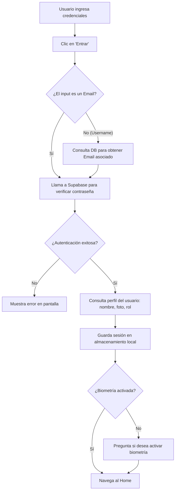

# Feature 01: Autenticación con Credenciales

## Descripción general

Permite al usuario iniciar sesión usando su **nombre de usuario** y contraseña. El sistema resuelve el username a un email real mediante un RPC de Supabase (`get_user_email`), autentica con `signInWithPassword`, obtiene el perfil del usuario (nombre, rol, avatar) y guarda la sesión en `localStorage`.

> **Nota técnica — ¿se puede ingresar con email?**: La UI etiqueta el campo únicamente como *"Usuario"* (placeholder: *"Ingrese su usuario"*), por lo que el usuario solo conoce el acceso por username. A nivel de código, `authService` sí acepta email: si el valor ingresado contiene `@`, **omite el RPC y lo usa directamente** como email en `signInWithPassword`. Esta capacidad no está comunicada al usuario en la interfaz.

Tras un login exitoso, si el usuario no tiene biometría activada, se le ofrecerá activarla antes de navegar al Home.

---

## Archivos involucrados

| Tipo | Archivo | Responsabilidad |
|------|---------|----------------|
| Página | `src/pages/Login.tsx` | Composición de la pantalla de login |
| Hook | `src/hooks/useLoginForm.ts` | Estado y lógica del formulario de login |
| Servicio | `src/services/authService.ts` | Comunicación con Supabase Auth |
| Componente | `src/components/login/LoginForm.tsx` | UI del formulario (inputs, botón, errores) |
| Componente | `src/components/login/LoginHeader.tsx` | Encabezado con logo y título |
| Componente | `src/components/login/BiometricAuth.tsx` | Botón de acceso biométrico (feature separada) |

---

## Flujo completo

Lo que ocurre paso a paso cuando un usuario inicia sesión:



**1. El usuario escribe su nombre de usuario y contraseña** en la pantalla de login y toca el botón *"Entrar"*.

**2. Se busca el email asociado al usuario.** Como Supabase autentica con email internamente, la app consulta la base de datos para obtener el email real que corresponde al nombre de usuario ingresado. *(Si el campo ingresado ya es un email, se omite este paso).*

**3. Se verifica la contraseña.** Con el email obtenido, se llama a Supabase para comprobar que la contraseña es correcta.

**4. Se carga el perfil del usuario.** Si la contraseña es válida, se obtiene de la base de datos el nombre completo, la foto de perfil y el rol del usuario (Administrador o Usuario normal).

**5. Se guarda la sesión en el dispositivo.** Toda esa información se almacena localmente para que la app recuerde al usuario sin necesidad de volver a iniciar sesión cada vez.

**6. Se comprueba si tiene biometría activada.** La app consulta si ese usuario ya activó el inicio de sesión por huella o Face ID.
- Si **no la tiene activada** → aparece un mensaje preguntando si desea activarla.
- Si **ya la tiene** → se navega directamente al inicio.

**7. Se navega al Home.** El usuario llega a la pantalla principal de la aplicación.

---

## Funciones y componentes detallados

### `authService.ts`

#### `loginWithCredentials(usernameInput, passwordInput)`
Función principal de autenticación. Pasos internos:

1. **Resolución de username**: Si el input no contiene `@`, llama al RPC `get_user_email` para obtener el email asociado.
2. **Autenticación**: Llama a `supabase.auth.signInWithPassword()`.
3. **Perfil**: Consulta la tabla `profiles` para obtener `full_name`, `avatar_url` y `roles`.
4. **Sesión**: Construye el objeto `UserSession` y lo persiste en `localStorage` via `setLocalUserSession()`.

```typescript
export const loginWithCredentials = async (
  usernameInput: string,
  passwordInput: string
): Promise<UserSession>
```

#### `setLocalUserSession(session)`
Guarda el objeto `UserSession` en `localStorage['user_session']` y genera un mock JWT token en `localStorage['auth_token']`.

#### `isAuthenticated()`
Retorna `true` si existe `auth_token` en `localStorage`. Usado por las rutas protegidas en `AppRoutes.tsx`.

#### `clearLocalUserSession()`
Elimina `user_session` y `auth_token` de `localStorage`. Llamado en logout.

#### `logoutUser()`
1. Desvincula el token FCM del dispositivo (`pushNotificationService.disassociateToken()`).
2. Llama a `clearLocalUserSession()`.
3. Llama a `supabase.auth.signOut()`.

---

### `useLoginForm.ts`

Hook que encapsula todo el estado y la lógica del formulario de login.

| Estado | Tipo | Descripción |
|--------|------|-------------|
| `username` | `string` | Valor del input de usuario |
| `password` | `string` | Valor del input de contraseña |
| `showPassword` | `boolean` | Togglea visibilidad de la contraseña |
| `error` | `string \| null` | Mensaje de error de credenciales |
| `loading` | `boolean` | Estado de carga durante el fetch |
| `enrollPromptOpen` | `boolean` | Controla si se muestra el modal de enrolamiento biométrico |
| `pendingSession` | `object \| null` | Datos temporales para enrolamiento biométrico |

#### `handleSubmit(e)`
1. Llama a `loginWithCredentials()`.
2. Asocia el token FCM con el usuario (`pushNotificationService.associateTokenWithUser()`).
3. Verifica si `biometrics_enabled` es `false` para mostrar el prompt de enrolamiento.
4. Navega a `/home` o espera la respuesta del prompt.

#### `handleEnrollResponse(confirmed)`
Si el usuario acepta el enrolamiento biométrico, llama a `enrollBiometric()`. Luego navega a `/home` independientemente de la respuesta.

#### `handleTogglePassword()`
Alterna `showPassword` para mostrar/ocultar la contraseña en el input.

> **Seguridad**: El hook usa `useIonViewWillLeave` para limpiar `username`, `password` y `error` cuando el usuario abandona la pantalla de login.

---

### `Login.tsx` (Página)

Composición declarativa de la pantalla. Orquesta los tres componentes de login:

```tsx
<IonPage>
  <IonContent>
    <LoginHeader />
    <LoginForm {...useLoginForm()} />
    <BiometricAuth />
  </IonContent>
</IonPage>
```

---

## Sesión en localStorage

| Clave | Valor |
|-------|-------|
| `user_session` | JSON del objeto `UserSession` (`id`, `name`, `email`, `role`, `avatarUrl`) |
| `auth_token` | Mock JWT token (base64 de la sesión + timestamp) |

---

## Tablas de BD involucradas

| Tabla | Uso |
|-------|-----|
| `auth.users` | Autenticación con Supabase Auth |
| `profiles` | Obtener `full_name`, `avatar_url`, `roles`, `biometrics_enabled` |
| `roles` | Join para obtener el nombre del rol |

---

## Manejo de errores

| Error | Mensaje mostrado |
|-------|-----------------|
| Username no encontrado en BD | "Nombre de usuario no encontrado." |
| Credenciales incorrectas | "Credenciales de inicio de sesión incorrectas." |
| Perfil no encontrado | "No se encontró el perfil del usuario." |
| Error genérico de Supabase | Mensaje del error de Supabase |
