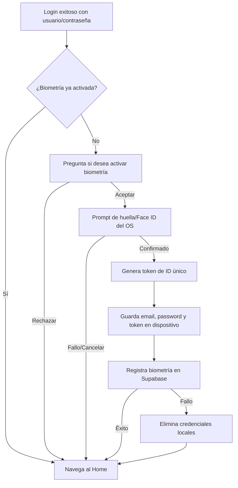
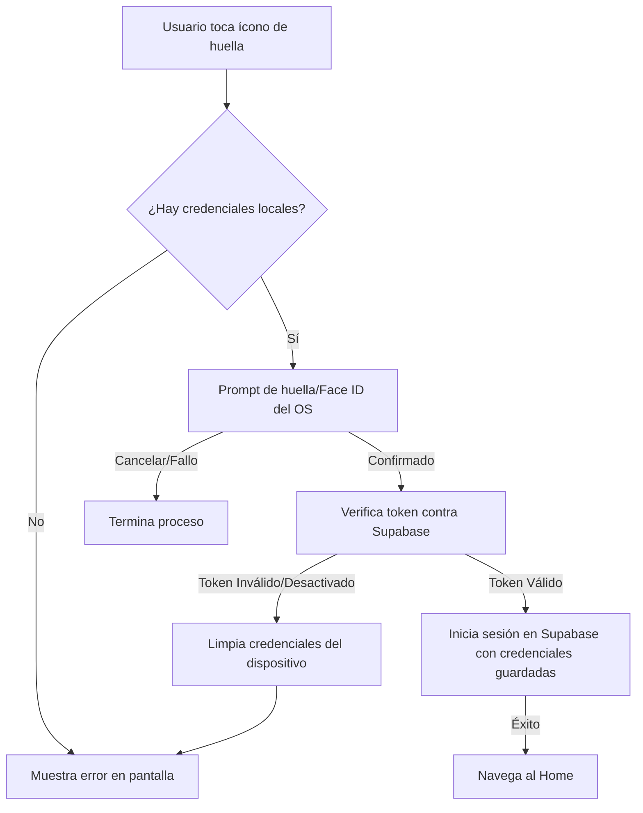

# Feature 02: Autenticación Biométrica

## Descripción general

Permite al usuario iniciar sesión usando huella dactilar o Face ID (en dispositivos nativos) o simularlo en el navegador. El sistema almacena las credenciales cifradas en el dispositivo y valida un token único contra Supabase para prevenir acceso no autorizado desde otros dispositivos.

---

## Archivos involucrados

| Tipo | Archivo | Responsabilidad |
|------|---------|----------------|
| Servicio | `src/services/biometricService.ts` | Toda la lógica de enrolamiento, login y revocación biométrica |
| Componente | `src/components/login/BiometricAuth.tsx` | Botón de acceso biométrico en la pantalla de login |
| Hook | `src/hooks/useLoginForm.ts` | Orquesta el prompt de enrolamiento tras el login exitoso |

---

## Flujo: Enrolamiento Biométrico

Lo que ocurre paso a paso cuando el usuario activa la biometría por primera vez:

**1. Se detecta que la biometría no está activada.** Tras un login exitoso con usuario y contraseña, la app consulta si ese usuario ya tiene biometría habilitada. Si no la tiene, continúa al paso 2.

**2. Se muestra un mensaje preguntando si desea activarla.** El usuario puede aceptar o rechazar. Si rechaza, va directamente al Home.

**3. El dispositivo pide confirmación de identidad.** Aparece el escáner de huella o Face ID del sistema operativo. Esto confirma que es el dueño del dispositivo quien está activando la biometría.

**4. Se genera un código de identificación único (token).** Este código servirá para vincular la biometría de este dispositivo específico con la cuenta del usuario.

**5. Se guardan las credenciales en el dispositivo.** El email, la contraseña y el token se almacenan de forma segura en el dispositivo.

**6. Se registra la biometría en la base de datos.** Se actualiza el perfil del usuario en Supabase indicando que tiene biometría activada y guardando el token de este dispositivo.

> Si el paso 6 falla, las credenciales guardadas en el dispositivo se eliminan automáticamente para dejar un estado limpio.

---

## Flujo: Login Biométrico

Lo que ocurre paso a paso cuando el usuario inicia sesión con su huella o Face ID:

**1. El usuario toca el ícono de huella en la pantalla de login.**

**2. La app busca las credenciales guardadas en el dispositivo.** Si no encuentra ninguna (por ejemplo, nunca se enroló en este dispositivo), muestra un error y cancela.

**3. El dispositivo pide la huella o Face ID.** El sistema operativo muestra el escáner biométrico. Si el usuario cancela, el proceso termina.

**4. Se verifica la autorización en la base de datos.** La app comprueba en Supabase que el token guardado en el dispositivo aún es válido y que la biometría no fue desactivada desde otro lugar. Esto evita que un dispositivo antiguo pueda entrar si el usuario revocó el acceso.

**5. Si todo es correcto, se inicia sesión.** Se usa el email y contraseña almacenados en el dispositivo para autenticarse igual que un login normal.

**6. Se navega al Home.**

---

## Funciones detalladas

### `enrollBiometric(userId, email, password)`
Enrola la biometría para el usuario actual.

1. Dispara el prompt biométrico nativo para confirmar identidad.
2. Genera un `UUID` aleatorio como `token`.
3. Guarda `{ email, password, token }` localmente en el dispositivo.
4. Actualiza `profiles` en Supabase: `biometrics_enabled = true`, `biometric_token_id = token`.
5. Si el UPDATE falla → revierte borrando las credenciales locales.

### `loginWithBiometric()`
Autentica al usuario usando biometría almacenada.

1. Carga credenciales del dispositivo.
2. Dispara el prompt biométrico.
3. Valida que el `token` guardado coincida en Supabase (`biometric_token_id`).
4. Si el token no existe o `biometrics_enabled = false` → limpia credenciales y lanza error.
5. Llama a `loginWithCredentials()` con las credenciales almacenadas.

### `unenrollBiometric(userId)`
Revoca la biometría del usuario.

1. Elimina las credenciales del dispositivo.
2. Actualiza `profiles`: `biometrics_enabled = false`, `biometric_token_id = null`.

### `hasStoredBiometricCredentials()`
Retorna `true` si hay credenciales biométricas guardadas en el dispositivo.

---

## Almacenamiento de credenciales

| Plataforma | Mecanismo | Clave |
|-----------|-----------|-------|
| **Nativa (Android/iOS)** | `@capacitor/preferences` | `biometric_credentials` |
| **Web (desarrollo)** | `localStorage` | `biometric_credentials` |

> ⚠️ En producción las credenciales se almacenan en `Preferences` de Capacitor, que usa el almacenamiento seguro del OS. En web se usa `localStorage` solo para desarrollo.

---

## Modo Web / Simulación

En entorno web (`isPlatform('capacitor') === false`), el sistema simula el hardware biométrico usando `window.confirm()`. Esto permite desarrollar y probar sin un dispositivo físico.

| Acción | Comportamiento en web |
|--------|-----------------------|
| Prompt biométrico | `window.confirm("Presiona Aceptar para simular...")` |
| Sin credenciales | Ofrece un bypass para ingresar manualmente y guardar credenciales |
| Validación de BD | Ofrece la opción de saltarse la verificación del token |

---

## Tablas de BD involucradas

| Tabla | Columnas usadas |
|-------|----------------|
| `profiles` | `biometrics_enabled` (boolean), `biometric_token_id` (text) |

---

## Manejo de errores

| Situación | Error lanzado |
|-----------|--------------|
| Prompt cancelado por el usuario | "Enrolamiento cancelado por el usuario." / "Autenticación biométrica cancelada." |
| Sin credenciales guardadas | "No hay credenciales biométricas registradas en este dispositivo." |
| Token no coincide en BD | "Este dispositivo ya no está autorizado..." |
| `biometrics_enabled = false` | "La autenticación biométrica está desactivada." |
| Error al actualizar BD | "No se pudo activar/desactivar la biometría en el servidor." |
