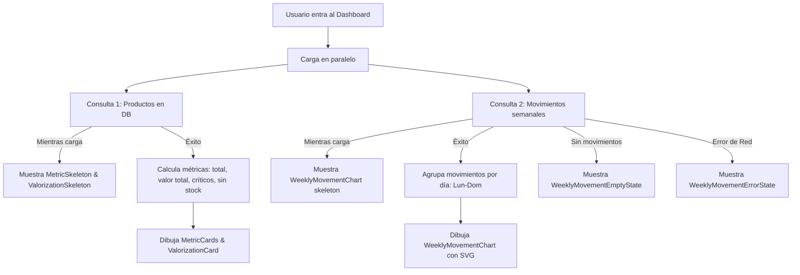

# Feature 03: Dashboard / Home

## Descripción general

La pantalla Home es el panel principal de la aplicación. Muestra métricas clave del inventario en tiempo real (total de productos, valor total, productos críticos y sin stock), una card de valorización del inventario y una gráfica de barras con los movimientos de stock de los últimos 7 días.

---

## Archivos involucrados

| Tipo | Archivo | Responsabilidad |
|------|---------|----------------|
| Página | `src/pages/Home.tsx` | Composición de la pantalla, invoca hooks |
| Componente | `src/components/dashboard/DashboardHeader.tsx` | Header con saludo y nombre del usuario |
| Componente | `src/components/dashboard/MetricCard.tsx` | Card individual de métrica (número + etiqueta) |
| Componente | `src/components/dashboard/MetricSkeleton.tsx` | Placeholder durante la carga de métricas |
| Componente | `src/components/dashboard/ValorizationCard.tsx` | Card con valor total del inventario en S/ |
| Componente | `src/components/dashboard/ValorizationSkeleton.tsx` | Placeholder durante la carga de valorización |
| Componente | `src/components/dashboard/WeeklyMovementChart.tsx` | Gráfica de barras de movimientos semanales |
| Componente | `src/components/dashboard/WeeklyMovementEmptyState.tsx` | Estado vacío cuando no hay movimientos |
| Componente | `src/components/dashboard/WeeklyMovementErrorState.tsx` | Estado de error en la carga de movimientos |
| Servicio | `src/services/movementService.ts` | Obtiene movimientos de los últimos 7 días |
| Utils | `src/utils/dashboardUtils.ts` | Calcula métricas desde la lista de productos |
| Utils | `src/utils/movementUtils.ts` | Agrupa movimientos por día para la gráfica |
| Hook | `src/hooks/useInventory.ts` | Provee la lista de productos y `totalCount` |

---

## ¿Cómo se carga la pantalla?

Cuando el usuario abre el Home, la pantalla hace dos consultas en paralelo:



**Consulta 1 — Productos del inventario:**
1. Se obtiene la lista completa de productos desde la base de datos.
2. Con esa lista se calculan 4 métricas: total de productos, valor total del inventario, cuántos tienen stock crítico y cuántos están sin stock.
3. Esas métricas se muestran en las tarjetas de la parte superior.
 
**Consulta 2 — Movimientos de la semana:**
1. Se obtienen todos los cambios de stock de los últimos 7 días.
2. Se agrupan por día de la semana (Lun, Mar, Mié, etc.) sumando entradas y salidas.
3. Con eso se dibuja la gráfica de barras.
 
> Mientras los datos están cargando se muestran bloques grises animados (skeletons) en lugar de los números reales, para que la pantalla no se vea vacía.

---

## Métricas del Dashboard

Las métricas se calculan en `src/utils/dashboardUtils.ts` a partir del array de productos cargado por `useInventory`:

| Métrica | Descripción | Cómo se calcula |
|---------|-------------|----------------|
| **Total Productos** | Cantidad total en catálogo | `products.length` |
| **Valor del Inventario** | Suma de `stock * price` de todos los productos | `Σ (product.stock * product.price)` |
| **Stock Crítico** | Productos con stock entre 1 y 5 | `products.filter(p => p.stock > 0 && p.stock <= 5)` |
| **Sin Stock** | Productos con stock = 0 | `products.filter(p => p.stock === 0)` |

---

## Componentes detallados

### `DashboardHeader`
Muestra el saludo y el nombre del usuario logueado. Lee la sesión de `localStorage` via `getLocalUserSession()`.

```tsx
<DashboardHeader /> 
// Renderiza: "Buenos días, Bryan 👋"
```

### `MetricCard`
Recibe `value`, `label`, `icon` y un `colorClass` para el acento visual. Tiene micro-animación de entrada.

```tsx
<MetricCard
  value={42}
  label="Total Productos"
  icon="📦"
  colorClass="text-primary"
/>
```

### `ValorizationCard`
Muestra el valor total del inventario formateado como moneda (soles peruanos S/).

### `WeeklyMovementChart`
Gráfica de barras construida con SVG puro (sin librería). Muestra entradas (`in`) y salidas (`out`) agrupadas por día de la semana.

**Props:**
| Prop | Tipo | Descripción |
|------|------|-------------|
| `movements` | `ProductMovement[]` | Array de movimientos de la semana |
| `loading` | `boolean` | Muestra skeleton si es true |
| `error` | `string \| null` | Muestra `WeeklyMovementErrorState` si existe |

**Estados posibles:**
- `loading = true` → `WeeklyMovementEmptyState` (skeleton)
- `movements.length === 0` → `WeeklyMovementEmptyState`
- `error !== null` → `WeeklyMovementErrorState`
- Normal → Gráfica de barras SVG con leyenda

---

## `movementUtils.ts`

### `groupMovementsByDay(movements)`
Toma el array de `ProductMovement[]` y retorna un objeto con los movimientos agrupados por día de la semana (Lun, Mar, Mié, Jue, Vie, Sáb, Dom).

```typescript
// Retorna: { "Lun": { in: 15, out: 8 }, "Mar": { in: 0, out: 22 }, ... }
```

---

## Estados de carga (Skeleton)

La pantalla implementa **skeleton loading** para mejorar la UX mientras los datos se cargan:

- Antes de que lleguen los productos → se muestran `MetricSkeleton` x4 y `ValorizationSkeleton`.
- Antes de que lleguen los movimientos → `WeeklyMovementEmptyState`.

---

## Tablas de BD involucradas

| Tabla | Uso |
|-------|-----|
| `products` | Lista completa de productos para calcular métricas |
| `product_movements` | Movimientos de stock de los últimos 7 días para la gráfica |
