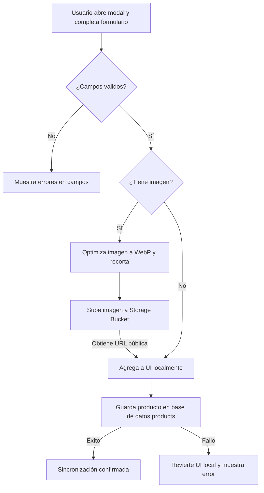
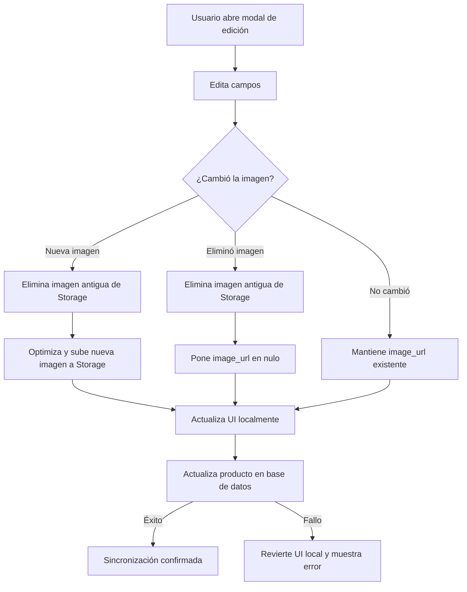
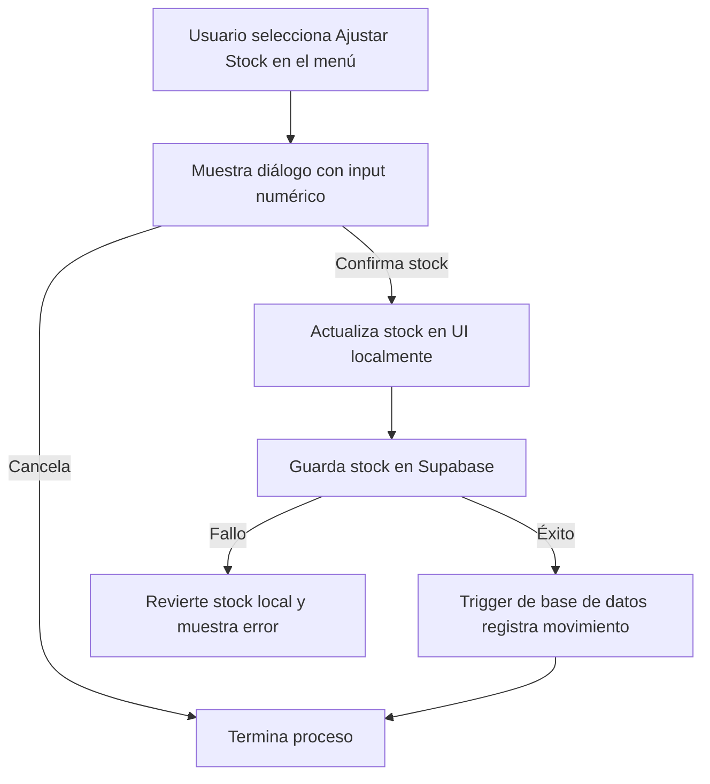

# Feature 04: Inventario de Productos (CRUD)

## Descripción general

La pantalla de Inventario es el núcleo del sistema. Permite visualizar todos los productos en formato de tarjetas, buscarlos por nombre, filtrarlos por estado y categoría, ordenarlos, y realizar las operaciones CRUD completas (crear, editar, ajustar stock, eliminar). Todas las escrituras implementan **optimistic updates** para una UX instantánea.

---

## Archivos involucrados

| Tipo | Archivo | Responsabilidad |
|------|---------|----------------|
| Página | `src/pages/Inventory.tsx` | Composición de la pantalla de inventario |
| Hook principal | `src/hooks/useInventory.ts` | Estado global del inventario: carga, CRUD, filtros |
| Hook | `src/hooks/useAddProduct.ts` | Estado y lógica del formulario de creación |
| Hook | `src/hooks/useEditProduct.ts` | Estado y lógica del formulario de edición |
| Hook | `src/hooks/useProductOptions.ts` | Action sheet y alerts por producto |
| Servicio | `src/services/productService.ts` | Acceso a Supabase: CRUD + imagen |
| Componente | `src/components/inventory/InventoryHeader.tsx` | Barra de búsqueda + botón de filtros |
| Componente | `src/components/inventory/ProductCard.tsx` | Tarjeta visual de un producto |
| Componente | `src/components/inventory/ProductSkeleton.tsx` | Placeholder durante la carga |
| Componente | `src/components/inventory/InventoryEmptyState.tsx` | Estado vacío cuando no hay resultados |
| Componente | `src/components/inventory/AddProductModal.tsx` | Modal de creación de producto |
| Componente | `src/components/inventory/FormAddProduct.tsx` | Formulario interno del modal de creación |
| Componente | `src/components/inventory/EditProductModal.tsx` | Modal de edición de producto |
| Componente | `src/components/inventory/InventoryFilterModal.tsx` | Modal de filtros y ordenamiento |
| Componente | `src/components/inventory/FilterGroup.tsx` | Grupo de chips de filtro (status/categoría) |
| Componente | `src/components/inventory/FormField.tsx` | Campo de formulario con label y error |
| Utils | `src/utils/inventoryFilters.ts` | Funciones de filtrado y ordenamiento |
| Data | `src/data/productsData.ts` | Tipo `Product`, función `getStatusFromStock` |
| Data | `src/data/filterOptions.ts` | Opciones de ordenamiento disponibles |
| Data | `src/data/statusStyles.ts` | Estilos CSS según estado del producto |

---

## Tipo `Product`

```typescript
interface Product {
  id: string;
  name: string;
  stock: number;
  price: number;
  category: string;
  image_url?: string | null;
  status: 'En Stock' | 'Crítico' | 'Sin Stock';  // calculado dinámicamente
}
```

### `getStatusFromStock(stock)`
Calcula el estado del producto según su nivel de stock:

| Stock | Status |
|-------|--------|
| `0` | `'Sin Stock'` |
| `1–5` | `'Crítico'` |
| `> 5` | `'En Stock'` |

---

## Flujo: Carga de productos

Cuando el usuario abre la pantalla de Inventario:

**1.** La pantalla muestra tarjetas grises de carga (skeleton) para que no se vea vacía.

**2.** Se consultan todos los productos de la base de datos.

**3.** Por cada producto se calcula automáticamente su estado: *En Stock*, *Crítico* (1-5 unidades) o *Sin Stock* (0 unidades).

**4.** Las tarjetas reales reemplazan a los skeletons y el usuario puede interactuar con ellas.

---

## Flujo: Crear producto

Cuando el usuario quiere agregar un nuevo producto:



**1.** Toca el botón “+” y se abre el modal de creación.

**2.** La app genera un ID único para el producto antes de que el usuario escriba nada.

**3.** El usuario completa los campos (nombre, categoría, stock, precio) y opcionalmente sube una foto.

**4.** Al tocar “Crear”, se validan los campos. Si falta algo o hay un valor incorrecto, se muestran los errores en el formulario sin cerrarlo.

**5. (Opcional) Si hay imagen:** se optimiza automáticamente (recorte cuadrado, conversión a WebP) y se sube al almacenamiento de Supabase.

**6.** El producto se guarda en la base de datos.

**7.** Aparece inmediatamente en la lista** sin necesidad de recargar la página (optimistic update). En segundo plano, la app sincroniza con la base de datos para asegurarse de que todo quedó bien.

---

## Flujo: Editar producto

Cuando el usuario quiere modificar un producto existente:



**1.** Toca la tarjeta del producto → aparece un menú con opciones: Editar, Ajustar Stock, Eliminar.

**2.** Selecciona “Editar Producto” y se abre el modal de edición con los datos actuales ya precargados.

**3.** El usuario modifica los campos que desea (nombre, categoría, precio y/o imagen).

**4.** Al tocar “Guardar”:
   - Si **cambió la imagen**: se elimina la foto antigua del almacenamiento y se sube la nueva.
   - Si **eliminó la imagen**: se borra del almacenamiento y el producto queda sin foto.
   - Si **no tocó la imagen**: se mantiene la existente.

**5.** Los cambios se guardan en la base de datos.

**6.** La tarjeta del producto se actualiza inmediatamente en pantalla** sin recargar (optimistic update).

---

## Flujo: Ajustar Stock

El ajuste de stock es una operación directa sin abrir un modal completo:



1. `useProductOptions.openProductMenu()` → muestra `IonActionSheet`.
2. Usuario selecciona "Ajustar Stock..." → aparece `IonAlert` con input numérico.
3. Confirma → `handleAdjustStock(product, newStock)` → `useInventory.updateStock(id, newStock)`.
4. **Optimistic update**: el estado local se actualiza inmediatamente y se recalcula el `status`.
5. Si Supabase falla → se revierte al estado anterior con `IonAlert` de error.

> El cambio de stock dispara el **trigger SQL** `tr_product_stock_change` que registra automáticamente el movimiento en `product_movements`.

---

## Flujo: Eliminar producto

1. `openProductMenu()` → "Eliminar Producto" → `IonAlert` de confirmación.
2. Confirma → `useInventory.deleteProduct(id, imageUrl)`.
3. **Optimistic remove**: el producto se elimina del estado local inmediatamente.
4. `productService.deleteProduct()`: elimina de la tabla `products` Y del `Storage` si tiene `image_url`.
5. Si falla → se revierte el estado local.

---

## Sistema de filtros

### Filtrado (`inventoryFilters.ts`)

| Función | Descripción |
|---------|-------------|
| `filterProducts(products, filters)` | Filtra por búsqueda (nombre), status y categoría |
| `sortProducts(products, sortKey)` | Ordena por nombre A-Z, Z-A, precio o stock |
| `getUniqueCategories(products)` | Extrae categorías únicas del array de productos |
| `countActiveFilters(sort, status, category)` | Cuenta cuántos filtros están activos (para el badge) |

### Búsqueda con Debounce

El valor del input de búsqueda se debounce 300ms antes de aplicar el filtro para evitar re-renders excesivos durante la escritura:

```typescript
useEffect(() => {
  const handler = setTimeout(() => setDebouncedSearchValue(searchValue), 300);
  return () => clearTimeout(handler);
}, [searchValue]);
```

### Opciones de ordenamiento (`filterOptions.ts`)

| Key | Descripción |
|-----|-------------|
| `name-asc` | Nombre A → Z (default) |
| `name-desc` | Nombre Z → A |
| `price-asc` | Precio menor primero |
| `price-desc` | Precio mayor primero |
| `stock-asc` | Menor stock primero |
| `stock-desc` | Mayor stock primero |

---

## `productService.ts` — Funciones

| Función | Descripción |
|---------|-------------|
| `fetchProducts()` | SELECT * FROM products, mapea status dinámicamente |
| `createProduct(product)` | INSERT INTO products, retorna el producto creado |
| `updateProduct(id, updates)` | UPDATE products WHERE id, retorna el producto actualizado |
| `updateProductStock(id, newStock)` | UPDATE solo el campo stock (para ajuste rápido) |
| `uploadProductImage(file, productId)` | Optimiza imagen → WebP, sube a Storage, retorna URL pública |
| `deleteProduct(id, imageUrl?)` | DELETE FROM products + remove del Storage |
| `deleteImageFromStorage(imageUrl)` | Extrae el path del URL y elimina solo la imagen del Storage |

---

## Persistencia de conteo en localStorage

El hook guarda el total de productos en `localStorage['inventory_last_product_count']`. Esto permite mostrar un número aproximado en el skeleton de la pantalla de inventory antes de que lleguen los datos reales de Supabase.

---

## Tablas de BD involucradas

| Tabla | Operación |
|-------|----------|
| `products` | SELECT, INSERT, UPDATE, DELETE |
| `product_movements` | Escritura indirecta via trigger SQL en cada INSERT/UPDATE de stock |

## Storage de Supabase involucrado

| Bucket | Uso |
|--------|-----|
| `products` | Almacena imágenes de productos en la ruta `{productId}/image_{timestamp}.webp` |
