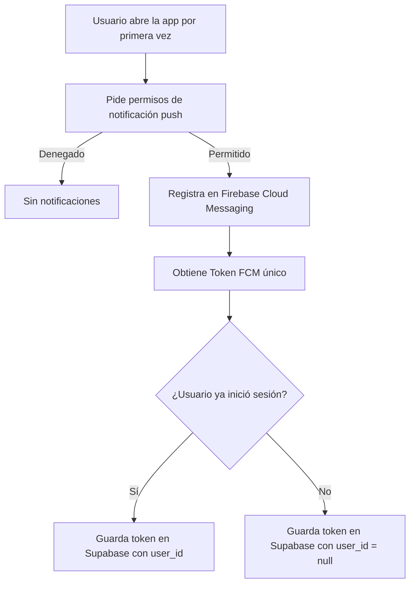
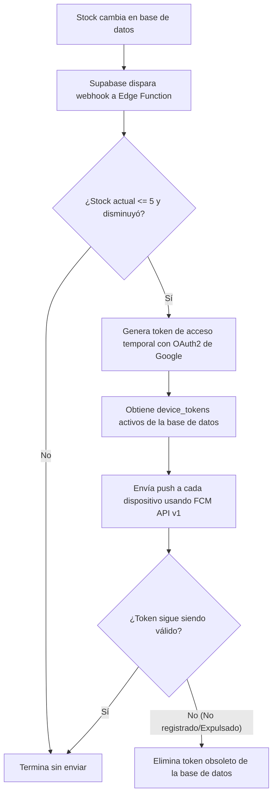

# Feature 06: Notificaciones Push

## Descripción general

El sistema envía notificaciones push a dispositivos Android (vía Firebase Cloud Messaging / FCM) cuando el stock de un producto llega a nivel crítico (≤ 5 unidades). El flujo involucra tres componentes: el **cliente móvil** (Capacitor), la **base de datos** (tabla `device_tokens`) y una **Supabase Edge Function** (Deno) que actúa como intermediario hacia FCM.

---

## Archivos involucrados

| Tipo | Archivo | Responsabilidad |
|------|---------|----------------|
| Servicio | `src/services/pushNotificationService.ts` | Registro FCM, gestión de tokens, asociación con usuario |
| Edge Function | `supabase/functions/send-stock-alert/index.ts` | Recibe webhook, valida stock crítico, envía push a FCM |
| BD (SQL) | `supabase_schema.sql` | Tabla `device_tokens` y políticas RLS |

---

## ¿Cómo funciona el sistema?

El sistema de notificaciones tiene tres partes que trabajan juntas:

- **La app móvil**: al instalarse, pide permiso al dispositivo para recibir notificaciones y obtiene un código único (token FCM) que identifica al dispositivo en Firebase.
- **La base de datos**: guarda esos tokens para saber a qué dispositivos enviar alertas.
- **Una función en la nube** (Edge Function): vigila los cambios de stock y, cuando detecta un stock crítico, contacta a Firebase para que éste envíe la notificación a todos los dispositivos registrados.

---

## Flujo 1: Registro del dispositivo

Cuando la app se abre por primera vez en el teléfono:



**1.** La app solicita al dispositivo permiso para enviar notificaciones push.

**2.** Si el usuario acepta, el dispositivo se registra en Firebase (FCM) y recibe un token único que identifica a este teléfono.

**3.** Ese token se guarda en la base de datos de Supabase. Si el usuario ya está logueado, el token queda vinculado a su cuenta; si aún no inició sesión, se guarda sin vincular.

---

## Flujo 2: Asociación del token al usuario tras login

Cuando el token FCM se registra **antes** de que el usuario inicie sesión, el `user_id` se guarda como `null`. Tras el login exitoso, se asocia el token al usuario:

```typescript
// En useLoginForm.ts, después de loginWithCredentials()
await pushNotificationService.associateTokenWithUser();
// Que internamente llama a:
await this.saveTokenToSupabase(cachedToken); 
// → UPSERT con user_id = session.id
```

---

## Flujo 3: Envío de alerta (Edge Function)

Cuando el stock de un producto baja a 5 unidades o menos:



**1.** Supabase detecta el cambio en la tabla de productos y activa automáticamente la Edge Function mediante un webhook.

**2.** La función verifica que el stock es crítico (≤ 5) **y** que el stock realmente disminuyó. Esto evita que se envíe una notificación repetida si el stock ya estaba crítico antes.

**3.** Si hay que notificar, la función obtiene un permiso temporal de Google (token OAuth2) para poder llamar a Firebase.

**4.** Consulta todos los tokens de dispositivos registrados en la base de datos.

**5.** Envía una notificación push a cada dispositivo registrado con el mensaje de alerta.

**6.** Si algún token ya no es válido (el dispositivo fue dado de baja o desinstaló la app), se elimina de la base de datos para no intentar contactarlo en el futuro.

---

## `pushNotificationService.ts` — Funciones

### `register()`
Inicializa el sistema de notificaciones push en plataformas nativas. Si corre en web/Vite, no hace nada (solo logea).

Listeners registrados:
| Evento | Descripción |
|--------|-------------|
| `registration` | Recibe el FCM token y lo guarda en caché + Supabase |
| `registrationError` | Loguea errores de registro con Firebase |
| `pushNotificationReceived` | App en primer plano: loguea la notificación recibida |
| `pushNotificationActionPerformed` | Usuario hizo tap en la notificación |

### `associateTokenWithUser()`
Si existe un `cachedToken` en memoria, llama a `saveTokenToSupabase()` para asociarlo al usuario recién logueado. Se llama inmediatamente después del login exitoso.

### `disassociateToken()`
Al cerrar sesión, actualiza `device_tokens.user_id = null` para el token actual. Esto evita que el próximo usuario del mismo dispositivo reciba alertas de la sesión anterior.

### `saveTokenToSupabase(token)`
Hace un `UPSERT` en `device_tokens` con `onConflict: 'token'` para evitar duplicados:
```typescript
{ token, device_model: 'Android', user_id: session?.id || null }
```

---

## Edge Function: `send-stock-alert`

### Variables de entorno requeridas

| Variable | Descripción |
|----------|-------------|
| `SUPABASE_URL` | URL del proyecto Supabase |
| `SUPABASE_SERVICE_ROLE_KEY` | Clave de servicio con acceso admin |
| `FIREBASE_SERVICE_ACCOUNT` | JSON completo de la Service Account de Firebase (stringificado) |

### Lógica de la función

1. **Recibe** el payload del webhook de Supabase (`record`, `old_record`).
2. **Valida** que `record.stock <= 5` y que el stock realmente disminuyó (o es una inserción crítica).
3. **Genera** un token OAuth2 firmando un JWT RS256 con la clave privada de Firebase.
4. **Consulta** todos los `device_tokens` activos.
5. **Envía** una notificación FCM a cada token vía la API v1 de FCM.
6. **Limpia** tokens obsoletos (errores 404 o `UNREGISTERED`) de la base de datos.

### `getGoogleAccessToken(serviceAccount)`
Genera el token OAuth2 de Google necesario para llamar a la FCM API v1:
1. Crea un JWT con claims `iss`, `scope`, `aud`, `exp`, `iat`.
2. Firma el JWT con la clave privada de la Service Account usando RS256.
3. Intercambia el JWT por un `access_token` en `https://oauth2.googleapis.com/token`.

### `importPrivateKey(pem)`
Convierte la clave privada PEM (PKCS#8) de la Service Account en un `CryptoKey` de Web Crypto API para firmar el JWT.

---

## Tabla `device_tokens`

```sql
CREATE TABLE public.device_tokens (
    id           UUID PRIMARY KEY DEFAULT gen_random_uuid(),
    token        TEXT UNIQUE NOT NULL,
    device_model TEXT,
    user_id      UUID REFERENCES auth.users(id) ON DELETE CASCADE,
    created_at   TIMESTAMP WITH TIME ZONE DEFAULT now() NOT NULL
);
```

| Campo | Descripción |
|-------|-------------|
| `token` | Token FCM único del dispositivo |
| `device_model` | Modelo del dispositivo (actualmente hardcodeado a `'Android'`) |
| `user_id` | Usuario actualmente logueado en ese dispositivo (nullable) |

### Ciclo de vida del token

| Evento | `user_id` |
|--------|---------|
| App instalada, sin login | `null` |
| Login exitoso | `= session.id` |
| Logout | `= null` |
| Token revocado por FCM | Eliminado de la tabla |

---

## Condición de alerta crítica

La Edge Function solo envía notificación si se cumplen **ambas condiciones**:

```typescript
const isCritical = product.stock <= 5;
const wasNotCriticalBefore = !oldProduct || oldProduct.stock > 5 || oldProduct.stock !== product.stock;

if (!isCritical || !wasNotCriticalBefore) {
  // No enviar notificación
}
```

Esto evita spam: si el stock ya estaba en crítico y no cambió, no se manda otra notificación.

---

## Mensaje FCM enviado

```json
{
  "message": {
    "token": "<device_fcm_token>",
    "notification": {
      "title": "⚠️ Alerta de Stock Crítico",
      "body": "El producto \"Arroz\" ha alcanzado un nivel crítico. Stock actual: 3 unidades."
    },
    "data": {
      "productId": "abc-123",
      "category": "Alimentos",
      "stock": "3"
    }
  }
}
```
