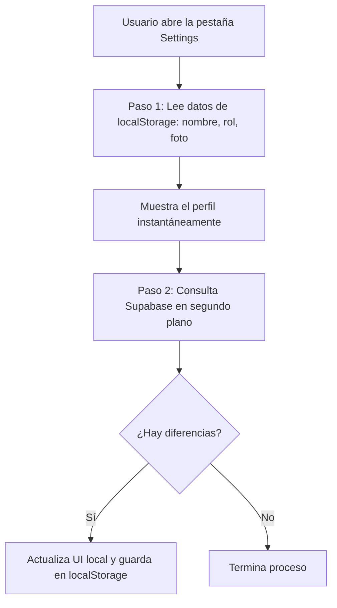

# Feature 07: Configuración (Settings)

## Descripción general

La pantalla de Settings centraliza la configuración de la cuenta del usuario, preferencias del sistema, herramientas de administración y soporte. Muestra el perfil del usuario (foto, nombre y rol), permite cambiar el avatar, y brinda acceso a acciones como cerrar sesión y crear nuevos usuarios (solo para administradores).

---

## Archivos involucrados

| Tipo | Archivo | Responsabilidad |
|------|---------|----------------|
| Página | `src/pages/Settings.tsx` | Composición de la pantalla |
| Hook | `src/hooks/useSettings.ts` | Estado, lógica de perfil, avatar y logout |
| Servicio | `src/services/avatarService.ts` | Subida del avatar al Storage de Supabase |
| Servicio | `src/services/authService.ts` | `logoutUser()`, `getLocalUserSession()`, `updateLocalUserSession()` |
| Componente | `src/components/settings/UserProfile.tsx` | Card de perfil con foto, nombre, rol y editor de avatar |
| Componente | `src/components/settings/SettingsTopBar.tsx` | Barra superior con título |
| Componente | `src/components/settings/SettingsGroup.tsx` | Contenedor de un grupo de opciones |
| Componente | `src/components/settings/SettingsItem.tsx` | Ítem individual de configuración |
| Componente | `src/components/settings/Separator.tsx` | Separador visual entre grupos |
| Componente | `src/components/settings/CreateUserModal.tsx` | Modal para crear nuevos usuarios |
| Data | `src/data/settingsData.ts` | Configuración declarativa de los ítems del menú |

---

## ¿Cómo se carga la pantalla de configuración?

La pantalla muestra el perfil del usuario en dos etapas para evitar que se vea vacía:



**1. Carga instantánea desde el dispositivo.** Al abrir Settings, la app lee los datos del usuario que ya estaban guardados localmente (nombre, foto, rol). Así el perfil aparece de inmediato sin esperar a internet.

**2. Actualización en segundo plano desde la base de datos.** A continuación, la app consulta Supabase para obtener los datos más recientes (por ejemplo, si el avatar fue cambiado desde otro dispositivo). Si hay cambios, la pantalla se actualiza automáticamente.

> La foto de perfil se carga con un parámetro de tiempo (`?t=timestamp`) al final de su URL para obligar al navegador a mostrar la versión nueva en lugar de una copia vieja guardada en caché.

---

## Secciones de configuración

La configuración está definida de forma **declarativa** en `src/data/settingsData.ts` mediante la función `getSettingsConfig()`. Cada grupo retorna un array de objetos con `label`, `icon` y `onClick`:

| Grupo | Contenido | Exportado como |
|-------|-----------|---------------|
| **Cuenta** | Seguridad, Notificaciones, Ubicación | `accountItems` |
| **Almacén** | Preferencias de inventario | `warehouseItems` |
| **Administración** | Gestión de Usuarios *(solo Admin)* | `adminItems` |
| **Soporte** | Centro de Ayuda | `supportItems` |

---

## `useSettings.ts` — Funciones

### Estado

| Estado | Tipo | Descripción |
|--------|------|-------------|
| `userProfile` | `{ name, role, avatarUrl? }` | Datos del perfil activo |
| `isModalOpen` | `boolean` | Controla la visibilidad del modal de crear usuario |

### `handleLogout()`
1. Llama a `logoutUser()` (desvincula token FCM + limpia localStorage + cierra sesión en Supabase).
2. Redirige a `/login` con `history.replace('/login')` (sin opción de volver atrás).

### `handleAvatarChange(newAvatarUrl)`
Actualiza el avatar del usuario con **optimistic update**:

1. Actualiza `userProfile.avatarUrl` localmente de forma inmediata.
2. Llama a `uploadAvatar(userId, newAvatarUrl)` para subir al Storage y actualizar BD.
3. Aplica cache buster (`?t=timestamp`) a la URL pública resultante.
4. Actualiza `localStorage` con la nueva URL.
5. Si falla → revierte la foto al valor anterior y muestra un `alert()`.

---

## `UserProfile.tsx`

Muestra la información del usuario y permite cambiar el avatar.

**Comportamiento al cambiar foto:**
1. Usuario toca la foto de perfil → se activa el `<input type="file" accept="image/*">` oculto.
2. El archivo seleccionado se pasa a `useAvatarEditor` para el flujo de recorte.
3. La imagen recortada (Data URL base64) se pasa a `handleAvatarChange()`.

---

## `settingsData.ts`

Define los ítems de configuración de forma declarativa para separar datos de UI:

```typescript
export const getSettingsConfig = (handlers: SettingsHandlers) => ({
  accountItems: [
    { label: 'Seguridad', icon: '🔒', onClick: handlers.onSecurity },
    { label: 'Notificaciones', icon: '🔔', onClick: handlers.onNotifications },
    { label: 'Ubicación', icon: '📍', onClick: handlers.onLocation },
  ],
  warehouseItems: [
    { label: 'Preferencias', icon: '⚙️', onClick: handlers.onPreferences },
  ],
  adminItems: [
    { label: 'Gestión de Usuarios', icon: '👥', onClick: handlers.onUserManagement },
  ],
  supportItems: [
    { label: 'Centro de Ayuda', icon: '❓', onClick: handlers.onHelp },
  ],
});
```

> **Nota**: Los ítems de administración se muestran a todos los usuarios actualmente. La lógica de ocultarlos para el rol `'User'` puede implementarse condicionalmente en `Settings.tsx`.

---

## Tablas de BD involucradas

| Tabla | Uso |
|-------|-----|
| `profiles` | Lectura de `full_name`, `avatar_url`, `roles` |
| `auth.users` | Obtener el `user.id` activo (`auth.getUser()`) |

## Storage de Supabase involucrado

| Bucket | Uso |
|--------|-----|
| `avatars` | Almacena avatares en la ruta `{userId}/avatar.webp` |
