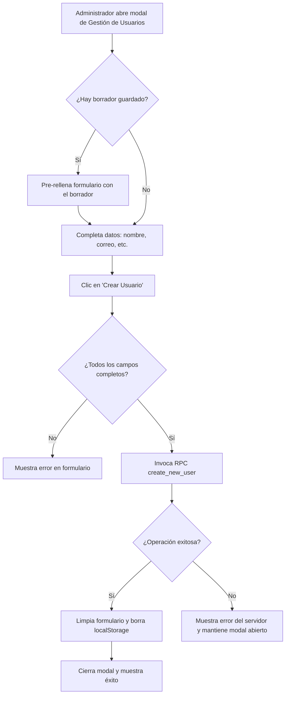

# Feature 08: Gestión de Usuarios (Admin)

## Descripción general

Permite a usuarios con rol `Administrador` crear nuevas cuentas de usuario directamente desde la pantalla de Settings. El proceso invoca un **RPC de Supabase** (`create_new_user`) que se ejecuta con privilegios de servicio para crear el usuario en `auth.users` y su perfil en `profiles` en una sola operación atómica.

El formulario incluye persistencia de borrador en `localStorage` y manejo de cambios no guardados al intentar cerrar.

---

## Archivos involucrados

| Tipo | Archivo | Responsabilidad |
|------|---------|----------------|
| Hook | `src/hooks/useCreateUser.ts` | Estado y lógica del formulario de creación de usuario |
| Componente | `src/components/settings/CreateUserModal.tsx` | Modal con el formulario de creación |
| Servicio | `src/services/supabaseClient.ts` | Cliente Supabase para invocar el RPC |

---

## Flujo de creación de usuario

Lo que ocurre cuando un administrador crea una nueva cuenta:



**1.** El administrador entra a Settings y toca *"Gestión de Usuarios"*. Se abre un modal con un formulario.

**2. (Opcional) Si hay un borrador guardado**, los campos se rellenan automáticamente con lo que el administrador había escrito antes de cerrar el modal sin terminar.

**3.** El administrador completa los datos: nombre completo, username, email, contraseña y rol.

**4.** Al tocar *"Crear Usuario"*, se valida que todos los campos estén completos.

**5.** La app llama a una función especial de la base de datos (`create_new_user`) que, en un solo paso, crea la cuenta de autenticación, el perfil del usuario y le asigna el rol elegido.

**6a. Si todo va bien:** aparece un mensaje de éxito, el formulario se limpia y el borrador guardado se elimina.

**6b. Si ocurre un error:** se muestra el mensaje de error sin cerrar el modal para que el administrador pueda corregirlo.

---

## `useCreateUser.ts` — Estado y funciones

### Estado del formulario

| Estado | Tipo | Descripción |
|--------|------|-------------|
| `fullName` | `string` | Nombre completo del nuevo usuario |
| `username` | `string` | Nombre de usuario único (para login sin email) |
| `email` | `string` | Correo electrónico |
| `password` | `string` | Contraseña inicial |
| `role` | `'Administrador' \| 'User'` | Rol asignado al usuario |
| `showPassword` | `boolean` | Visibilidad de la contraseña |
| `loading` | `boolean` | Estado durante el RPC |
| `message` | `{ type, text } \| null` | Resultado de la operación (success/error) |

### `handleSubmit(e)`
1. Valida que todos los campos estén completos.
2. Invoca `supabase.rpc('create_new_user', { ... })`.
3. Muestra mensaje de éxito o error.
4. En éxito: limpia el formulario y el borrador del `localStorage`.

### `handleCloseAttempt()`
Si el usuario intenta cerrar el modal con cambios sin guardar, muestra un `IonAlert` con tres opciones:

| Opción | Acción |
|--------|--------|
| **Guardar borrador** | Guarda en `localStorage['create_user_draft']` y cierra |
| **Descartar cambios** | Limpia el formulario y el borrador, cierra |
| **Seguir editando** | Cancela el cierre |

### Persistencia de borrador

El hook usa `useIonViewWillLeave` para guardar automáticamente el borrador si el usuario navega fuera de la pantalla con datos escritos:

```typescript
useIonViewWillLeave(() => {
  if (fullName || username || email || password) {
    localStorage.setItem('create_user_draft', JSON.stringify({ fullName, username, email, role }));
  }
});
```

Al abrir el modal nuevamente (`isOpen = true`), carga el borrador guardado.

> **Nota de seguridad**: La contraseña **no se guarda en el borrador** para proteger la privacidad del usuario.

---

## RPC `create_new_user`

El RPC es una función PostgreSQL que se ejecuta con `SECURITY DEFINER`, lo que le otorga privilegios de superusuario para crear entradas en `auth.users` (normalmente restringido).

**Parámetros:**

| Parámetro | Tipo | Descripción |
|-----------|------|-------------|
| `new_email` | `text` | Email del nuevo usuario |
| `new_password` | `text` | Contraseña inicial |
| `new_full_name` | `text` | Nombre completo |
| `new_username` | `text` | Username único |
| `new_role_name` | `text` | `'Administrador'` o `'User'` |

---

## `CreateUserModal.tsx`

Modal con formulario que incluye:
- Campos: Nombre completo, Username, Email, Contraseña (con toggle de visibilidad), Rol (select).
- Muestra un spinner en el botón durante la operación.
- Muestra el `message` de éxito/error tras el envío.
- Llama a `handleCloseAttempt()` al intentar cerrar para verificar cambios pendientes.

---

## Roles disponibles

| Valor | Descripción |
|-------|-------------|
| `'User'` | Acceso estándar (default) |
| `'Administrador'` | Acceso completo, puede crear usuarios |

---

## Tablas de BD involucradas

| Tabla | Operación |
|-------|----------|
| `auth.users` | INSERT (via RPC con SECURITY DEFINER) |
| `profiles` | INSERT (full_name, username, avatar_url) |
| `roles` | INSERT (asignación del rol al perfil) |
