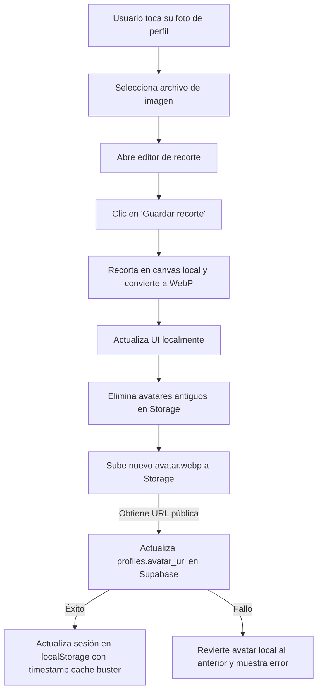

# Feature 09: Avatar / Foto de Perfil

## Descripción general

Permite al usuario cambiar su foto de perfil con un flujo completo de selección, recorte interactivo y optimización de imagen. La imagen seleccionada se recorta en forma cuadrada usando un canvas HTML5, se convierte a WebP, y se sube al bucket `avatars` de Supabase Storage. El perfil en la BD se actualiza con la nueva URL pública.

---

## Archivos involucrados

| Tipo | Archivo | Responsabilidad |
|------|---------|----------------|
| Hook | `src/hooks/useAvatarEditor.ts` | Estado del cropper: imagen, crop, zoom, acciones |
| Utils | `src/utils/cropImage.ts` | Recorte de imagen con Canvas API |
| Utils | `src/utils/imageOptimizer.ts` | Optimización y conversión a WebP para imágenes de productos |
| Servicio | `src/services/avatarService.ts` | Base64 → Blob → Storage → BD |
| Componente | `src/components/settings/UserProfile.tsx` | Integra el editor de avatar en la UI |

---

## Flujo completo de cambio de avatar

Lo que ocurre paso a paso cuando el usuario cambia su foto de perfil:



**1.** El usuario toca su foto en la pantalla de Settings.

**2.** Se abre el explorador de archivos del dispositivo para seleccionar una imagen.

**3.** Una vez seleccionada, aparece un **editor de recorte** donde el usuario puede arrastrar y hacer zoom para encuadrar su cara como quiera.

**4.** Al tocar *"Guardar recorte"*, la imagen se recorta en forma cuadrada usando el navegador (sin enviarla aún al servidor) y se convierte automáticamente al formato WebP para que pese menos.

**5. La foto nueva aparece de inmediato en pantalla** (aunque todavía no está guardada en el servidor). Esto es el "optimistic update" — la respuesta visual es instantánea.

**6.** En segundo plano, la app sube la imagen al almacenamiento de Supabase:
   - Primero borra cualquier foto antigua del usuario para no acumular archivos.
   - Luego sube la nueva foto.
   - Obtiene la URL pública de la imagen recién subida.

**7.** El perfil del usuario en la base de datos se actualiza con la nueva URL de la foto.

**8.** La sesión guardada en el dispositivo también se actualiza para que la próxima vez que se abra la app ya se vea la foto nueva.

> Si algo falla en los pasos 6-7, la foto en pantalla vuelve a ser la anterior automáticamente.

---

## `useAvatarEditor.ts`

Hook que gestiona el estado del editor de imagen (cropper).

### Estado

| Estado | Tipo | Descripción |
|--------|------|-------------|
| `imageSrc` | `string \| null` | Data URL de la imagen seleccionada (activa el cropper) |
| `crop` | `{ x, y }` | Posición actual del recorte |
| `zoom` | `number` | Nivel de zoom del cropper (1 = sin zoom) |
| `croppedAreaPixels` | `{ x, y, width, height } \| null` | Coordenadas exactas del recorte en píxeles |

### Funciones

| Función | Descripción |
|---------|-------------|
| `handleAvatarClick()` | Activa programáticamente el `<input type="file">` oculto |
| `handleFileChange(e)` | Lee el archivo seleccionado como Data URL y activa el cropper |
| `onCropComplete(_, pixels)` | Callback del cropper que guarda las coordenadas finales del recorte |
| `handleSave()` | Llama a `getCroppedImg()` y pasa el resultado a `onAvatarChange()` |
| `handleCancel()` | Cierra el cropper sin guardar y resetea el input file |

---

## `cropImage.ts` — `getCroppedImg(imageSrc, pixelCrop)`

Recorta una imagen usando Canvas API del navegador.

**Proceso:**
1. Crea un `<canvas>` con las dimensiones del área de recorte.
2. Dibuja (`drawImage`) solo la porción recortada de la imagen original.
3. Exporta el canvas a Data URL en formato WebP con calidad 85%.

**Parámetros:**
| Parámetro | Tipo | Descripción |
|-----------|------|-------------|
| `imageSrc` | `string` | Data URL de la imagen original |
| `pixelCrop` | `{ x, y, width, height }` | Área a recortar en píxeles |

**Retorna:** `Promise<string>` → Data URL base64 de la imagen recortada en WebP.

---

## `imageOptimizer.ts` — `optimizeAndConvertToWebP(file, targetSize?, quality?)`

Usada para optimizar imágenes de **productos** (no avatares). Hace un recorte cuadrado automático centrado y redimensiona a un tamaño fijo.

| Parámetro | Default | Descripción |
|-----------|---------|-------------|
| `file` | — | Archivo de imagen original |
| `targetSize` | `300` | Dimensión del cuadrado final en píxeles |
| `quality` | `0.75` | Calidad de compresión WebP (0–1) |

**Proceso:**
1. Calcula el lado mínimo (`min(width, height)`) para el recorte cuadrado.
2. Dibuja en canvas con `imageSmoothingQuality = 'high'`.
3. Exporta a WebP. Si el navegador no soporta WebP → fallback a JPEG.

---

## `avatarService.ts` — `uploadAvatar(userId, base64Image)`

Maneja toda la operación de subida del avatar al backend.

**Pasos internos:**
1. Convierte el Data URL base64 a `Blob` usando `fetch()`.
2. **Limpieza**: lista los archivos existentes del usuario en `avatars/{userId}/` y elimina los que no son `avatar.webp` (para no acumular archivos obsoletos).
3. Sube el Blob con `upsert: true` a la ruta `{userId}/avatar.webp`.
4. Obtiene la URL pública del archivo subido.
5. Actualiza `profiles.avatar_url` en la BD con la URL pública.

---

## Cache Buster

Para evitar que el navegador muestre la versión cacheada del avatar anterior, la URL se sirve con un timestamp al final:

```typescript
const finalAvatarUrl = `${publicUrl}?t=${Date.now()}`;
```

Este parámetro no afecta la URL real en Storage, solo fuerza al navegador a descargar la imagen nueva.

---

## Storage de Supabase involucrado

| Bucket | Ruta | Descripción |
|--------|------|-------------|
| `avatars` | `{userId}/avatar.webp` | Foto de perfil del usuario |

## Tablas de BD involucradas

| Tabla | Campo | Operación |
|-------|-------|----------|
| `profiles` | `avatar_url` | UPDATE con la nueva URL pública |
