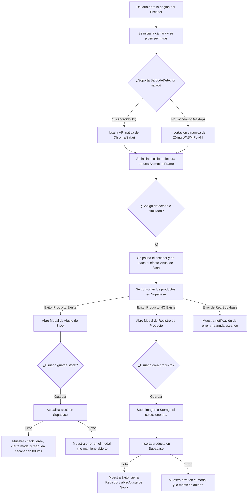

# Feature 10: Escáner de Código de Barras y Cámara

## Descripción general

Permite al usuario escanear códigos de barras de productos (como EAN-13, UPC, Code 128, etc.) en tiempo real usando la cámara del dispositivo móvil o de la computadora. 

Incorpora un bucle de escaneo híbrido inteligente que detecta si el navegador tiene soporte nativo y completo para `BarcodeDetector` (como en Android o iOS 17+), y en caso de no tener soporte funcional (como en Chrome de Windows o Safari de escritorio), carga de forma diferida (lazy load) un polyfill en WebAssembly basado en **ZXing-C++** para procesar los cuadros de video localmente. En entornos de desarrollo o sin cámara, ofrece un simulador flotante que genera lecturas aleatorias para pruebas.

---

## Archivos involucrados

| Tipo | Archivo | Responsabilidad |
|------|---------|----------------|
| Página | `src/pages/Scanner.tsx` | Composición de la pantalla de escaneo, visor de cámara, botón del simulador y controles del flash. |
| Componente | `src/components/scanner/ScannerViewfinder.tsx` | UI de máscara translúcida con el cutout del área de escaneo (cuadrado centrado) y línea láser animada. |
| Componente | `src/components/scanner/ScannerProductModal.tsx` | Modal de ajuste de stock rápido del producto escaneado. |
| Componente | `src/components/scanner/ScannerRegisterModal.tsx` | Modal con el formulario de creación rápida si el código escaneado no está registrado en el sistema. |
| Hook | `src/hooks/useCamera.ts` | Controla el ciclo de vida del flujo de video (`MediaStream`), la solicitud de permisos de la cámara trasera y el encendido del flash (torch). |
| Hook | `src/hooks/useBarcodeScanner.ts` | Administra el bucle `requestAnimationFrame` de captura de fotogramas, validando disponibilidad nativa o cargando dinámicamente el polyfill de WebAssembly. |
| Hook | `src/hooks/useScanner.ts` | Orquestador principal que conecta el flujo de video y el resultado de la lectura con las consultas en Supabase. |
| Hook | `src/hooks/useScannerStock.ts` | Lógica de incremento/decremento y guardado rápido de stock en el modal. |
| Utils | `src/utils/scannerUtils.ts` | Formatos de códigos soportados, retrasos y efectos. |
| Estilos | `src/theme/variables.css` | Define las clases personalizadas para la UI del visor, esquinas del cutout, brillo de la linterna y animaciones del láser. |

---

## Flujo completo de escaneo

Lo que ocurre paso a paso cuando un usuario escanea un código:

**1. Inicio de la Cámara:** Al abrir la pestaña, se solicita permiso de cámara trasera (`facingMode: 'environment'`) y se enlaza la corriente de video (`MediaStream`) al elemento `<video>` de la pantalla.

**2. Verificación de Compatibilidad:**
   * Se comprueba si `window.BarcodeDetector` está disponible nativamente y si su función `getSupportedFormats()` reporta soporte para `ean_13`.
   * En caso de no ser compatible (por ejemplo, en sistemas de escritorio como Windows), la aplicación realiza una importación dinámica asíncrona de `barcode-detector` que monta el motor de detección de códigos de barra ZXing compilado a WebAssembly en segundo plano.

**3. Bucle de Detección:** Una vez que el reproductor de video está listo y transmitiendo datos (`readyState >= 2`), se inicia un bucle de fotogramas vía `requestAnimationFrame` que pasa la imagen actual a la función `.detect()` de la API.

**4. Detección Exitosa:**
   * Se detiene el bucle de detección inmediatamente (`isPaused = true`) para evitar registrar el código repetidas veces.
   * Se ejecuta una transición de flash en pantalla durante `200ms` como respuesta visual clara.
   * Se consulta a Supabase mediante `productService.fetchProducts()` para ver si el código existe.

**5a. Si el producto ya existe:** Se abre el modal `ScannerProductModal` permitiendo al usuario cambiar el stock actual usando un stepper de aumento/disminución y guardar directamente.

**5b. Si el producto no está registrado:** Se abre el modal `ScannerRegisterModal` cargando el código escaneado de forma predeterminada como ID. El usuario completa los datos y, al confirmar la creación, se le abre el modal de stock de forma consecutiva para que el flujo no se interrumpa.

**6. Reanudación:** Al cerrarse cualquier modal, se ejecuta un pequeño retraso de seguridad de `800ms` antes de habilitar de nuevo el bucle de lectura (`isPaused = false`), previniendo escaneos no deseados de inmediato.

---

## Funciones y hooks detallados

### `useCamera.ts`
Controla el inicio y parada del hardware de cámara.
* `startCamera()`: Solicita acceso a la webcam y configura el `srcObject` del elemento de video.
* `toggleFlash()`: Comprueba `capabilities.torch` para encender o apagar la linterna en el dispositivo móvil de forma nativa.
* **Limpieza**: En el desmontaje del hook, invoca `stopStream()` deteniendo todas las pistas de audio/video (`track.stop()`) previniendo consumo fantasma de batería.

### `useBarcodeScanner.ts`
Implementa el bucle de detección de imágenes.
* Valida la existencia nativa del lector y sus formatos o descarga el paquete WASM condicionalmente.
* Realiza un control de cuadros con `readyState >= 2` para asegurarse de que hay datos de video antes de analizarlos.

### `useScanner.ts`
Orquestador que sincroniza las alertas, visualización de overlays de escaneo, llamadas a base de datos y control de apertura de los modals.
* Garantiza que la pausa del bucle sea respetada en todo momento (`isPaused`).

---

## Modo Simulación / Desarrollo

En entornos locales donde el dispositivo no posee una cámara trasera o en computadoras de escritorio donde no hay códigos de barra físicos a mano, la interfaz muestra un **simulador flotante**.

* Al hacer clic en el botón de simular, genera un código de barras de prueba (un identificador único UUID) y lo inyecta como si la cámara lo hubiera detectado, permitiendo validar todo el flujo de registro, búsqueda en la base de datos Supabase, y ajuste de stock.

---

## Tablas de BD involucradas

| Tabla | Columnas usadas / Acción |
|-------|-------------------------|
| `products` | Lectura completa (`fetchProducts`), inserción (`createProduct`), actualización rápida de stock (`updateProductStock`). |
| `product_movements` | Registros automáticos de entradas/salidas vía trigger SQL tras cada cambio de stock. |

---

## Storage de Supabase involucrado

| Bucket | Ruta | Uso |
|--------|------|-------------|
| `products` | `{productId}/image_{timestamp}.webp` | Almacena la foto del producto en caso de registrar un nuevo artículo con foto desde el escáner. |
